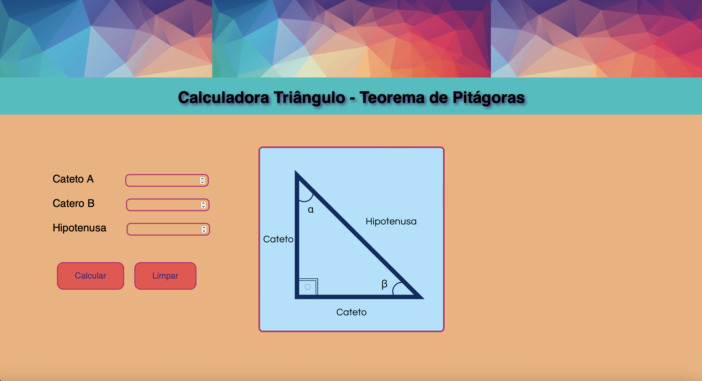

# teoremaDePitagoras
<h1 text-align="center" >Calculadora - Teorema de Pitágoras</h1>

Projeto desenvolvido para calcular a relação entre os lados de um triângulo retângulo (teorema de Pitágoras). Utilizando HTML5, CSS, TypeScript.

Funcionalidades: 

Como os usuários podem utilizá-lo:

Onde os usuários podem encontrar ajuda sobre seu projeto:

Autores do projeto: Diego Ailton Prudêncio

<h4 text-align="center"> 
	🚧  Calculadora do Teorama de Pitágoras 🚀 Finalizado
</h4>

<h1 text-align="center">

</h1>

### 🛠 Tecnologias

As seguintes ferramentas foram usadas na construção do projeto:

- [Expo](https://expo.io/)
- [Node.js](https://nodejs.org/en/)
- [React](https://pt-br.reactjs.org/)
- [React Native](https://reactnative.dev/)
- [TypeScript](https://www.typescriptlang.org/)

Licenças: MIT License - Copyright (c) 2022 Diego Ailton Prudêncio

Título e Imagem de capa; Badges; Índice; Descrição do Projeto; Status do Projeto; Funcionalidades e Demonstração da Aplicação; Acesso ao Projeto; Tecnologias utilizadas; Pessoas Contribuidoras; Pessoas Desenvolvedoras do Projeto; Licença.